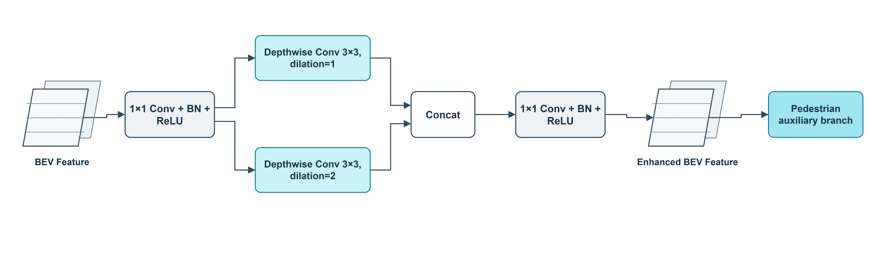
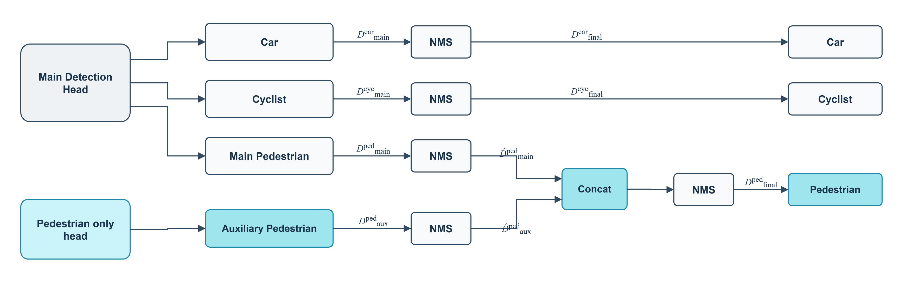

# DPHC-PointPillars

Research implementation of **DPHC-PointPillars**, a LiDAR-only PointPillars
extension for small and difficult-object detection on KITTI.

This repository is built on [OpenPCDet](https://github.com/open-mmlab/OpenPCDet)
and preserves its Apache-2.0 license and upstream history.

## Method

- **DPE (Density-aware Pillar Encoding)** appends normalized pillar occupancy
  **N_i / N_max** before PFN encoding. It is an occupancy proxy, not physical
  point density.
- **PFCB (Pedestrian Full-resolution Context Branch)** reads the stride-1 BEV
  map and applies parallel depthwise convolutions with dilation 1 and 2. The
  main detector is frozen during stage-2 training.
- **CPF (Class-selective Prediction Fusion)** keeps main-head Car and Cyclist
  detections unchanged and fuses only main/auxiliary Pedestrian candidates.

The public entry point is **PointPillarDPHC**. The legacy
**PointPillarPedestrianAux** name remains available for compatibility.

## Tested environment

Ubuntu 22.04 (WSL2), Python 3.10.20, PyTorch 2.12.0+cu130, CUDA 13.0,
spconv 2.3.6, and NVIDIA GeForce RTX 5060 Ti. See
[docs/ENVIRONMENT.md](docs/ENVIRONMENT.md).

## KITTI preparation

Place KITTI 3D object-detection data under **data/kitti** and follow the
[OpenPCDet guide](docs/GETTING_STARTED.md). KITTI data, generated databases and
checkpoints are not distributed here.

## Training

All commands use **--fix_random_seed --seed 666**.

### Validation protocol

Stage 1 trains DPE for 80 epochs. Stage 2 loads epoch 80, freezes the main path,
and trains the auxiliary branch for 50 epochs.

~~~bash
bash tools/scripts/train_dphc_val.sh
~~~

A stage-2 checkpoint may be selected only on the validation split. Its epoch
and selection metric must be reported.

### Official KITTI test protocol

The trainval protocol uses all 7,481 labeled frames. Stage 1 is fixed to 80
epochs and stage 2 to 33 epochs; no best-epoch selection is performed.

~~~bash
bash tools/scripts/train_dphc_trainval.sh
bash tools/scripts/generate_kitti_test.sh /path/to/checkpoint_epoch_33.pth
~~~

## Evaluation

~~~bash
bash tools/scripts/eval_dphc_val.sh /path/to/dphc_checkpoint.pth
~~~

Detailed provenance is in [docs/RESULTS.md](docs/RESULTS.md). Validation and
official-test results are intentionally separated.

## Core configurations

| Config | Controlled change |
|---|---|
| pointpillar.yaml | PointPillars baseline |
| pointpillar_dpe.yaml | DPE only |
| pointpillar_dphc.yaml | DPE + PFCB + CPF |
| pointpillar_dphc_no_density.yaml | remove DPE |
| pointpillar_dphc_identity.yaml | raw stride-1 auxiliary head |
| pointpillar_dphc_stride2.yaml | block-1 stride-2 features |
| pointpillar_dphc_single_dilation.yaml | dilation 1 only |
| pointpillar_dphc_ped_cyc.yaml | Pedestrian+Cyclist supervision |

## Weights

Weights are not included in the initial release. Publish them later through
GitHub Releases or another large-file host, never as ordinary Git objects.

## Limitations

- Extreme-distance and very-low-point targets remain difficult.
- Cyclist gains originate from DPE, not the Pedestrian-only auxiliary head.
- Camera images in qualitative figures are visualization aids only.

## Acknowledgements and license

Derived from OpenPCDet and PointPillars. Original notices are retained. See
[LICENSE](LICENSE) and [NOTICE](NOTICE).
